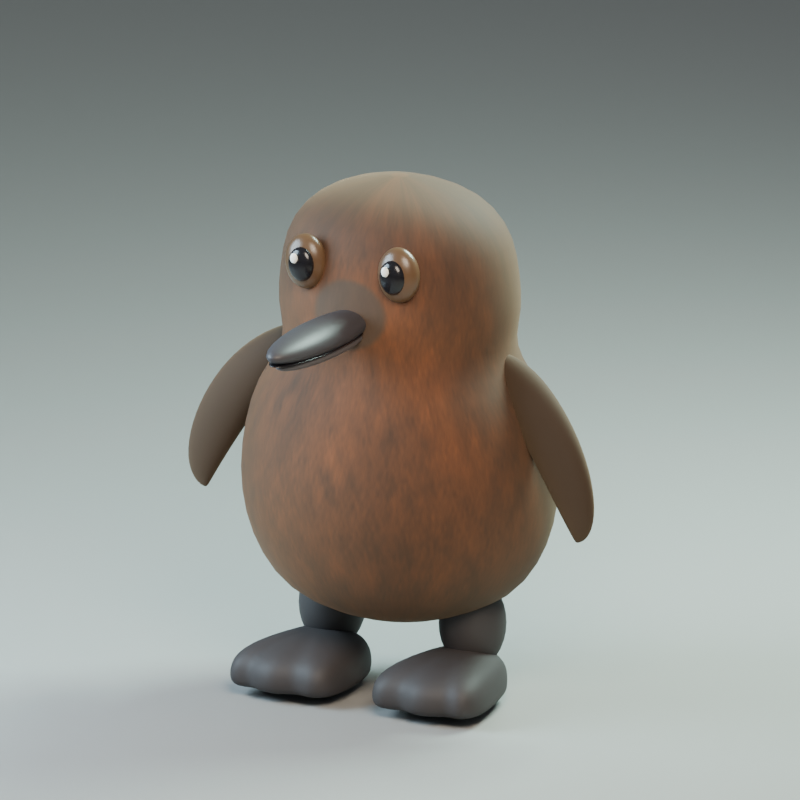

# penguin

A stylized low-poly penguin model for Unreal Engine, plus the script that generates it.


## Files

| File | What it is |
|---|---|
| `models/penguin.glb` | glTF binary. Recommended for Unreal 5. Metres, Y-up (the importer converts to cm / Z-up). |
| `models/penguin.obj` + `penguin.mtl` | Wavefront OBJ. Centimetres, Z-up, +X forward. |
| `models/penguin_preview.png` | Render of the model from four angles. |
| `tools/make_penguin.py` | Generator script. Edit the numbers, rerun, and both model files are rebuilt. |

The penguin is about 66 cm tall and 47 cm wide, stands with its feet on the origin plane, and faces +X.
It has 15 named parts, 9,056 triangles and five material slots: `PenguinBody`, `PenguinBelly`, `PenguinBeak`,
`PenguinEye` and `PenguinPupil`. Each slot carries a flat base colour so it shows up coloured on import,
and you can swap in your own materials in the Static Mesh editor.

## Importing into Unreal Engine 5

1. Drag `models/penguin.glb` into the Content Browser (or **Import** and pick the file).
2. In the Interchange import dialog keep the defaults. Make sure **Combine Static Meshes** is on so the 15
   parts come in as one Static Mesh with five material slots. Turn it off if you want each part as its own asset.
3. Click **Import**. The mesh lands at the right scale (cm) and orientation (Z-up) automatically.
4. Optional: open the Static Mesh, set a collision (the auto convex works fine) and generate LODs.

For the OBJ, import the same way. If it comes in 100 times too large or small, set the import
**Uniform Scale** to 1.0 and the file unit to centimetres.

## Regenerating or tweaking the model

```
pip install numpy scipy trimesh pillow
python3 tools/make_penguin.py
```

Every part is an ellipsoid or cone placed in centimetres inside `build_parts()`. Changing a radius,
position or colour in that function and rerunning the script rebuilds the GLB, the OBJ and the preview.

## Pebble (rigged character) and the waddle cycle

`pebble/Pebble_Penguin/` holds the Pebble character package (Blender source, `SK_Pebble.fbx` skeletal
mesh, Idle and Jump clips, texture and validation reports; see its `README_Unreal.txt` for import steps).

Added on top of the package:

| File | What it is |
|---|---|
| `pebble/Pebble_Penguin/AN_Pebble_Waddle.fbx` | 33-frame looping waddle at 30 fps, root stationary (in place). Same mesh and skeleton as the other clips. |
| `pebble/Pebble_Penguin/Pebble_Waddle.gif` | Rendered preview of the loop. |
| `pebble/Pebble_Penguin/Preview_Waddle.png` | Four key poses of the cycle. |
| `pebble/Pebble_Penguin/Pebble_Waddle.blend` | The source scene with the `Pebble_Waddle` action added. |
| `tools/make_pebble_waddle.py` | Script that authors the cycle, exports the FBX and renders the preview. |


Import `AN_Pebble_Waddle.fbx` exactly like the Idle clip (Import Mesh off, Import Animations on, Pebble
skeleton selected, 30 fps). Frame 33 repeats frame 1, so enable looping on the Animation Sequence. The clip
has no root motion; drive forward speed from Character Movement. Each stride covers about 16 cm, so a
walk speed near 30 cm/s matches the feet; faster than that will show some foot slide.

To tweak the cycle (sway, lift, stride, flipper swing) edit the constants at the top of the script and rerun:

```
pip install bpy pillow
python3 tools/make_pebble_waddle.py --package pebble/Pebble_Penguin --out pebble/Pebble_Penguin
```

## Pebble Chick (brown king-penguin-chick variant)

`pebble/Pebble_Chick/` is a restyle of Pebble as a fluffy brown king penguin chick: chocolate down with
streaks, a lighter chest and darker back, bare grey skin at the bill base, a long slender dark bill, small
dark eyes, dark feet, no crest, and a wider, lower body with a smaller head. It uses the **same 16-bone
skeleton** as Pebble, so clips are interchangeable between the two characters.



| File | What it is |
|---|---|
| `SK_Pebble_Chick.fbx` | Skeletal mesh, rest pose, 28,384 triangles, 9 material slots, texture embedded. |
| `AN_Pebble_Chick_Idle.fbx`, `AN_Pebble_Chick_Jump.fbx`, `AN_Pebble_Chick_Waddle.fbx` | Idle (31 f), jump test (48 f) and waddle loop (33 f) at 30 fps, in place. |
| `T_Chick_Body_BaseColor.png` | 1024-square base colour for the body (sRGB). Other slots are flat colours. |
| `Pebble_Chick.blend`, `Pebble_Chick_Waddle.blend` | Editable scenes, the second one with the waddle action added. |
| `Preview_*.png`, `Pebble_Chick_Waddle.gif` | Renders. |
| `tools/build_pebble_chick.py` | Generates the whole variant; derived from the package's `build_pebble.py`. |

Import exactly as described for Pebble in `pebble/Pebble_Penguin/README_Unreal.txt`: the skeletal mesh first
with no skeleton assigned, then each animation FBX with Import Mesh off and the new skeleton selected.
Because bone names match Pebble's, you can also import the chick mesh onto Pebble's skeleton asset and
share one Animation Blueprint between both characters.

Rebuild or tweak (colours, bill, eye size and body profile are all near the top of the script):

```
pip install bpy numpy scipy pillow
python3 tools/build_pebble_chick.py --out pebble/Pebble_Chick
python3 tools/make_pebble_waddle.py --package pebble/Pebble_Chick --blend Pebble_Chick.blend --prefix Pebble_Chick --out pebble/Pebble_Chick
```
