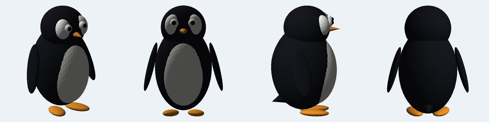
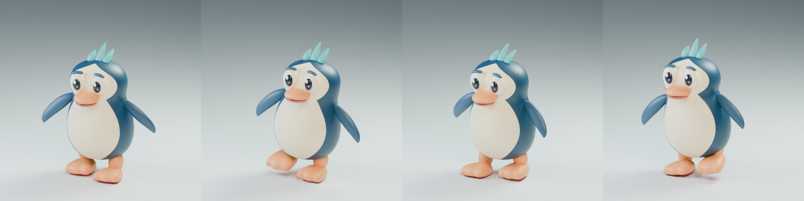
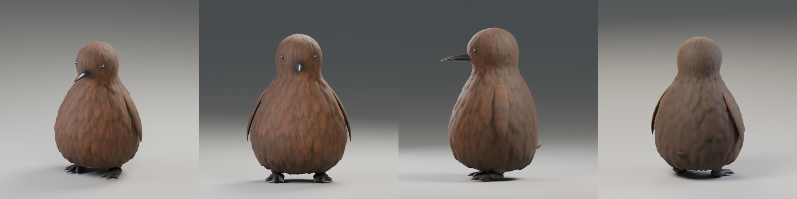
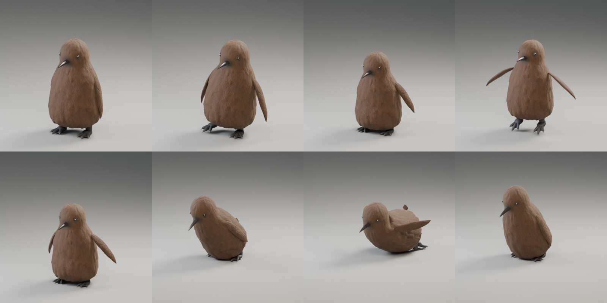

# penguin

A stylized low-poly penguin model for Unreal Engine, plus the script that generates it.



## Files

| File | What it is |
|---|---|
| `models/penguin.glb` | glTF binary. Recommended for Unreal 5. Metres, Y-up (the importer converts to cm / Z-up). |
| `models/penguin.obj` + `penguin.mtl` | Wavefront OBJ. Centimetres, Z-up, +X forward. |
| `models/penguin_preview.png` | Render of the model from four angles. |
| `tools/make_penguin.py` | Generator script. Edit the numbers, rerun, and both model files are rebuilt. |

The penguin is about 66 cm tall and 47 cm wide, stands with its feet on the origin plane, and faces +X.
It has 15 named parts, 9,056 triangles and five material slots: `PenguinBody`, `PenguinBelly`, `PenguinBeak`,
`PenguinEye` and `PenguinPupil`. Each slot carries a flat base colour so it shows up coloured on import,
and you can swap in your own materials in the Static Mesh editor.

## Importing into Unreal Engine 5

1. Drag `models/penguin.glb` into the Content Browser (or **Import** and pick the file).
2. In the Interchange import dialog keep the defaults. Make sure **Combine Static Meshes** is on so the 15
   parts come in as one Static Mesh with five material slots. Turn it off if you want each part as its own asset.
3. Click **Import**. The mesh lands at the right scale (cm) and orientation (Z-up) automatically.
4. Optional: open the Static Mesh, set a collision (the auto convex works fine) and generate LODs.

For the OBJ, import the same way. If it comes in 100 times too large or small, set the import
**Uniform Scale** to 1.0 and the file unit to centimetres.

## Regenerating or tweaking the model

```
pip install numpy scipy trimesh pillow
python3 tools/make_penguin.py
```

Every part is an ellipsoid or cone placed in centimetres inside `build_parts()`. Changing a radius,
position or colour in that function and rerunning the script rebuilds the GLB, the OBJ and the preview.

## Pebble (rigged character) and the waddle cycle

`pebble/Pebble_Penguin/` holds the Pebble character package (Blender source, `SK_Pebble.fbx` skeletal
mesh, Idle and Jump clips, texture and validation reports; see its `README_Unreal.txt` for import steps).

Added on top of the package:

| File | What it is |
|---|---|
| `pebble/Pebble_Penguin/AN_Pebble_Waddle.fbx` | 33-frame looping waddle at 30 fps, root stationary (in place). Same mesh and skeleton as the other clips. |
| `pebble/Pebble_Penguin/Pebble_Waddle.gif` | Rendered preview of the loop. |
| `pebble/Pebble_Penguin/Preview_Waddle.png` | Four key poses of the cycle. |
| `pebble/Pebble_Penguin/Pebble_Waddle.blend` | The source scene with the `Pebble_Waddle` action added. |
| `tools/make_pebble_waddle.py` | Script that authors the cycle, exports the FBX and renders the preview. |



Import `AN_Pebble_Waddle.fbx` exactly like the Idle clip (Import Mesh off, Import Animations on, Pebble
skeleton selected, 30 fps). Frame 33 repeats frame 1, so enable looping on the Animation Sequence. The clip
has no root motion; drive forward speed from Character Movement. Planted feet travel about 12.4 cm per
step (one two-step cycle every 1.07 s), so a walk speed near 23 cm/s matches the feet. Faster than that
shows foot slide unless you scale the play rate.

To tweak the cycle (sway, lift, stride, flipper swing) edit the constants at the top of the script and rerun:

```
pip install bpy pillow
python3 tools/make_pebble_waddle.py --package pebble/Pebble_Penguin --out pebble/Pebble_Penguin
```

## Pebble Chick (brown king-penguin-chick variant)

`pebble/Pebble_Chick/` is a king penguin chick built on Pebble's skeleton. It has its own geometry,
modelled from a reference photo of a real chick:

- **Pear-shaped body.** The body is lowest and widest at the belly, with a forward belly bulge, a visible neck and a smaller, slightly elongated head.
- **Real down in the mesh.** About 840 overlapping teardrop tufts hang downward and are displaced into the surface. They are long and shaggy at the hem, full on the body and short on the head, and the skin is nearly bare around the bill and eyes. The base-colour texture is generated from the same tuft field, so the dark creases and lighter tuft tips line up with the geometry.
- **Bill.** The bill is glossy near-black, tapered and slightly decurved. The upper mandible has a ridge and a tip that hooks just past the lower one.
- **Eyes.** The small eyes are dark brown-black and glossy, set into the head under a thin, low ring of bare skin.
- **Feet.** Each foot has three thick, knuckled toes with hooked claws and webbing almost to the tips.
- **Flippers.** The flippers hang flat against the sides and use the same down material as the body.



| | |
|---|---|
| Triangles | 47,908 |
| Material slots | 8 (body down uses a 1024-square texture, the rest are flat colours) |
| Skeleton | Pebble's 16 bones, identical names, max 2 influences, weights normalized |
| Height | about 152 cm, matching Pebble's scale |

| File | What it is |
|---|---|
| `SK_Pebble_Chick.fbx` | Skeletal mesh, rest pose, texture embedded. |
| `AN_Pebble_Chick_*.fbx` | Nine clips at 30 fps, skeleton only: Idle, Waddle, Waddle_RootMotion, Jump_Start, Jump_Loop, Jump_Land, BellySlide_Start, BellySlide_Loop, BellySlide_End. See the animation table below. |
| `T_Chick_Body_BaseColor.png` | Base colour for the down (sRGB). |
| `Pebble_Chick.blend`, `Pebble_Chick_Anims.blend` | Editable scenes. The second one holds all nine clips as actions. |
| `Preview_*.png`, `Pebble_Chick_*.gif` | Renders. `Preview_Animations.png` shows a key pose from each clip. The GIFs show Idle, Waddle, the jump chain and the belly-slide chain. `Preview_Sheet.png` shows hero, front, side and back views. `Compare_Eye_Bill.png` shows the eye and bill before and after the second iteration. |
| `tools/chick_geometry.py` | All chick shapes: profile, tuft field, texture, bill, feet, flippers. Pure numpy. |
| `tools/build_pebble_chick.py` | Builds the Blender scene and rig, exports the skeletal mesh and renders previews, using `chick_geometry.py`. Pass `--no-previews` to skip the renders. |
| `tools/make_chick_anims.py` | Authors the nine clips, exports one FBX per clip and renders the GIFs. |
| `tools/verify_chick_anims.py` | Checks loop seams, clip-to-clip pose matches, planted-foot slip and the FBX round trip, and writes `anim_validation.json`. |
| `tools/render_chick_closeups.py` | Renders fixed close-ups of the eye, bill and feet from a built `.blend`, for comparing versions. |

Full Unreal import notes for the chick, including materials, animation details and how to add hair strands,
are in `pebble/Pebble_Chick/README_Unreal.txt`. In short, import the skeletal mesh
first with no skeleton assigned. Then import each animation FBX with Import Mesh off and the new skeleton
selected. The chick's FBX files name the armature object "Armature", so Unreal does not add an extra bone above
`root` and root motion works. The blue Pebble's package files still use the old name, so they cannot share the
chick's skeleton in Unreal until they are re-exported the same way. At 48k triangles it is fine for a hero character, but generate LODs in the
Skeletal Mesh editor for crowds or distant views.

**Animations for Unreal.** All clips are 30 fps and in place except the root-motion waddle. Loops repeat
their first pose on the last frame, and every one-shot clip starts or ends on the rest pose or on its loop's
first frame, so they chain without pops.

| Clip | Frames | Loop | What it does |
|---|---|---|---|
| Idle | 91 (3.0 s) | Yes | Breathing, weight shift, a slow glance, feet planted. |
| Waddle | 33 (1.07 s) | Yes | Walk cycle. Planted feet move at a constant 23.25 cm/s, so set walk speed to match. |
| Waddle_RootMotion | 33 | Yes | Same pose, with the root bone carrying 24.8 cm per cycle. |
| Jump_Start | 10 | No | Crouch and launch. |
| Jump_Loop | 25 | Yes | Airborne, flippers flapping. Height comes from Character Movement. |
| Jump_Land | 18 | No | Feet plant on frame 3, squash, settle to rest. |
| BellySlide_Start | 24 | No | Crouch, lunge, flop onto the belly. |
| BellySlide_Loop | 33 | Yes | Tobogganing: head up, flippers out, feet trailing and kicking. |
| BellySlide_End | 28 | No | Push up with the flippers and stand. |



Compared with the earlier clips, the waddle's planted feet no longer slide. They previously slid about 2.5 cm
sideways and 1.3 cm front to back per step, and they now measure 0.0 cm. The 1-second idle became a 3-second
loop with more life. The jump test, which had its height baked into the pelvis, became separate start, loop
and land clips for gameplay.

**Second iteration (eyes, bill, feet).** Each part was changed only if it clearly beat the previous
version in blind A/B review. Three independent reviewers saw randomised left and right renders next to the
reference photo. A change was adopted only if at least two picked it and none preferred the old version with
medium or high confidence.

| Part | Result |
|---|---|
| Eyes | Adopted. All three reviewers preferred the new eye with high confidence. |
| Bill | Adopted. All three preferred the new bill with medium confidence. |
| Feet | Not adopted. Paddle-style webbing and darker claws never beat the original in three rounds, so the original feet are unchanged. |

To tweak the shape, edit `tools/chick_geometry.py`. `CTRL` is the body profile. `tuft_size` and
`displacement_amp` control how shaggy the down is. `bill` and `foot_parts` shape the bill and feet. Then rebuild:

```
pip install bpy numpy scipy pillow
python3 tools/build_pebble_chick.py --out pebble/Pebble_Chick
python3 tools/make_chick_anims.py --blend pebble/Pebble_Chick/Pebble_Chick.blend --out pebble/Pebble_Chick
python3 tools/verify_chick_anims.py pebble/Pebble_Chick
```
