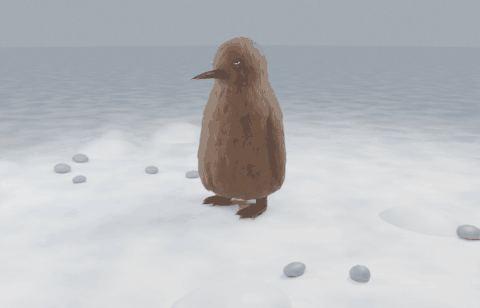
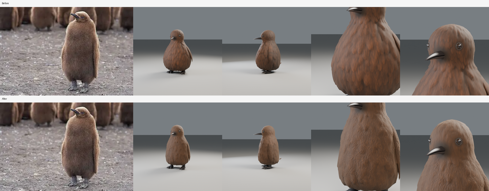
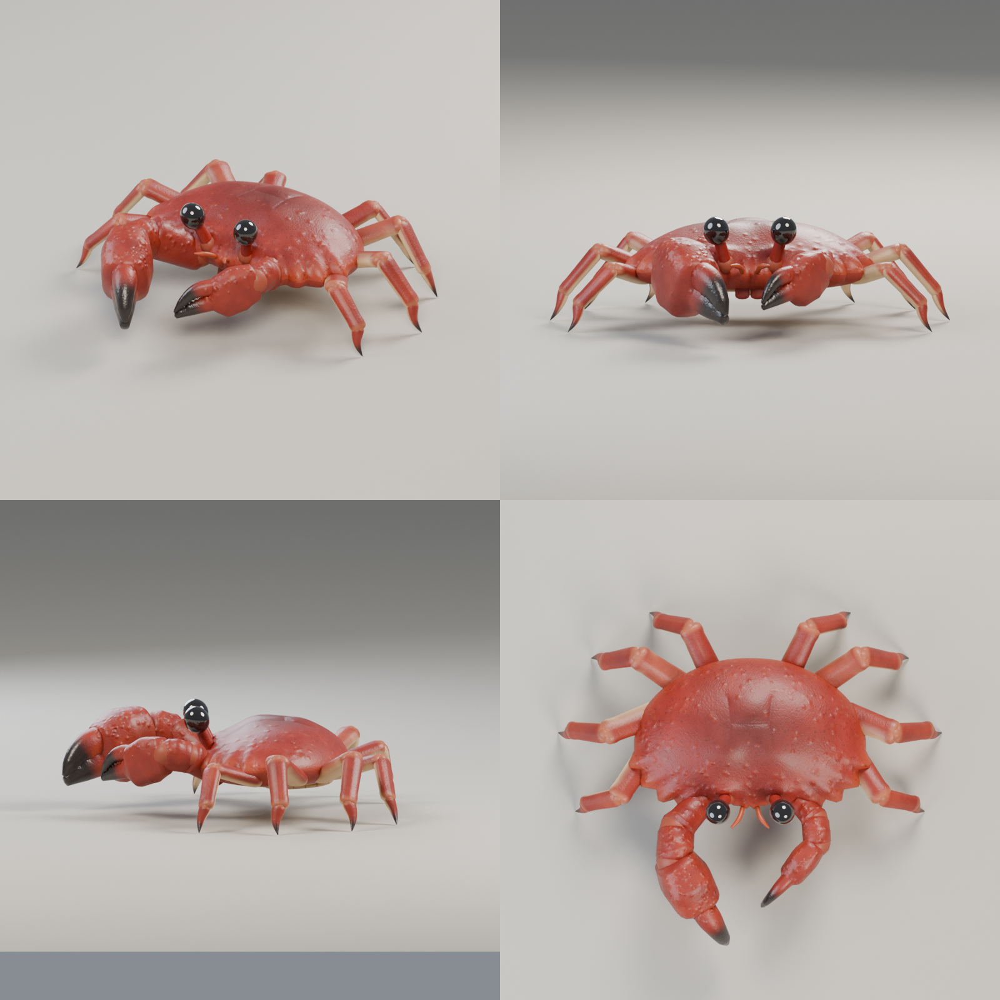
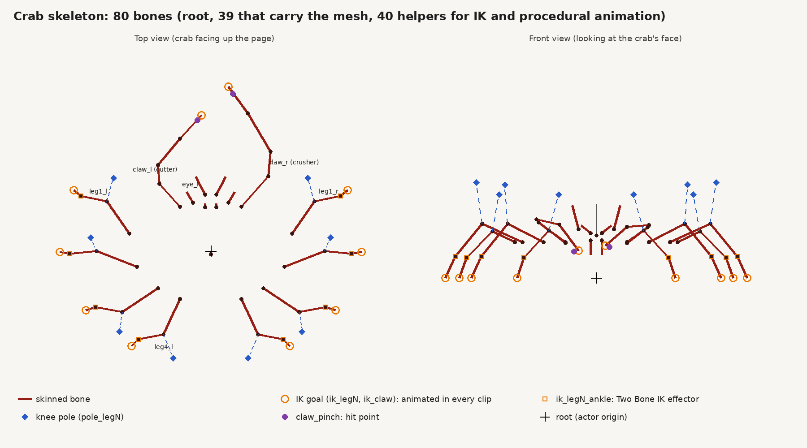
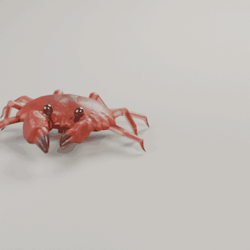
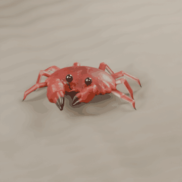

# penguin

A stylized low-poly penguin model for Unreal Engine, plus the script that generates it.


## Files

| File | What it is |
|---|---|
| `models/penguin.glb` | glTF binary. Recommended for Unreal 5. Metres, Y-up (the importer converts to cm / Z-up). |
| `models/penguin.obj` + `penguin.mtl` | Wavefront OBJ. Centimetres, Z-up, +X forward. |
| `models/penguin_preview.png` | Render of the model from four angles. |
| `tools/make_penguin.py` | Generator script. Edit the numbers, rerun, and both model files are rebuilt. |

The penguin is about 66 cm tall and 47 cm wide, stands with its feet on the origin plane, and faces +X.
It has 15 named parts, 9,056 triangles and five material slots: `PenguinBody`, `PenguinBelly`, `PenguinBeak`,
`PenguinEye` and `PenguinPupil`. Each slot carries a flat base colour so it shows up coloured on import,
and you can swap in your own materials in the Static Mesh editor.

## Importing into Unreal Engine 5

1. Drag `models/penguin.glb` into the Content Browser (or **Import** and pick the file).
2. In the Interchange import dialog keep the defaults. Make sure **Combine Static Meshes** is on so the 15
   parts come in as one Static Mesh with five material slots. Turn it off if you want each part as its own asset.
3. Click **Import**. The mesh lands at the right scale (cm) and orientation (Z-up) automatically.
4. Optional: open the Static Mesh, set a collision (the auto convex works fine) and generate LODs.

For the OBJ, import the same way. If it comes in 100 times too large or small, set the import
**Uniform Scale** to 1.0 and the file unit to centimetres.

## Regenerating or tweaking the model

```
pip install numpy scipy trimesh pillow
python3 tools/make_penguin.py
```

Every part is an ellipsoid or cone placed in centimetres inside `build_parts()`. Changing a radius,
position or colour in that function and rerunning the script rebuilds the GLB, the OBJ and the preview.

## Pebble (rigged character) and the waddle cycle

`pebble/Pebble_Penguin/` holds the Pebble character package (Blender source, `SK_Pebble.fbx` skeletal
mesh, Idle and Jump clips, texture and validation reports; see its `README_Unreal.txt` for import steps).

Added on top of the package:

| File | What it is |
|---|---|
| `pebble/Pebble_Penguin/AN_Pebble_Waddle.fbx` | 33-frame looping waddle at 30 fps, root stationary (in place). Same mesh and skeleton as the other clips. |
| `pebble/Pebble_Penguin/Pebble_Waddle.gif` | Rendered preview of the loop. |
| `pebble/Pebble_Penguin/Preview_Waddle.png` | Four key poses of the cycle. |
| `pebble/Pebble_Penguin/Pebble_Waddle.blend` | The source scene with the `Pebble_Waddle` action added. |
| `tools/make_pebble_waddle.py` | Script that authors the cycle, exports the FBX and renders the preview. |


Import `AN_Pebble_Waddle.fbx` exactly like the Idle clip (Import Mesh off, Import Animations on, Pebble
skeleton selected, 30 fps). Frame 33 repeats frame 1, so enable looping on the Animation Sequence. The clip
has no root motion; drive forward speed from Character Movement. Planted feet travel about 12.4 cm per
step (one two-step cycle every 1.07 s), so a walk speed near 23 cm/s matches the feet. Faster than that
shows foot slide unless you scale the play rate.

To tweak the cycle (sway, lift, stride, flipper swing) edit the constants at the top of the script and rerun:

```
pip install bpy pillow
python3 tools/make_pebble_waddle.py --package pebble/Pebble_Penguin --out pebble/Pebble_Penguin
```

## Pebble Chick (brown king-penguin-chick variant)

**Download for Unreal:** [`dist/PebbleChick_Unreal.zip`](dist/PebbleChick_Unreal.zip) has the mesh and skeleton, all
eleven animations, the textures, reference data, previews and the Blender sources. Its `IMPORT_GUIDE.html`
walks through importing into Unreal Engine 5 and setting up the Character and Animation Blueprints. The guide's
source is `pebble/Pebble_Chick/IMPORT_GUIDE.md`, and `python3 tools/package_chick_unreal.py` rebuilds the zip.

`pebble/Pebble_Chick/` is a king penguin chick built on Pebble's skeleton. Its geometry was modelled from
reference photos of real chicks and refined over three iterations:

- **Body shape.** A tall, straight-sided column, heaviest low down, with broad shoulders that flow into a small head without a neck pinch.
- **Down.** About 730 soft down clumps are displaced into the surface. A normal map adds fine, gently wavy fibres, and the head has shorter, smoother down. The colour is an even tawny cinnamon with lighter fibre tips, matched to the photos.
- **Legs and feet.** The down stops above short, dark legs with faint scale rings, so the legs show above the three-toed, clawed feet.
- **Bill.** The bill is glossy near-black, tapered and slightly decurved. The upper mandible has a ridge and a tip that hooks just past the lower one.
- **Eyes.** The small eyes are dark brown-black and glossy, set into the head under a thin, low ring of bare skin.
- **Flippers.** Long flippers hang close along the sides, covered in the same down, with the fibres running along their length.


| | |
|---|---|
| Triangles | 49,124 |
| Material slots | 8 (the body down uses a 1024-square colour texture and normal map, the rest are flat colours) |
| Skeleton | Pebble's 16 bones, identical names, max 2 influences, weights normalized |
| Height | about 152 cm, matching Pebble's scale |

| File | What it is |
|---|---|
| `SK_Pebble_Chick.fbx` | Skeletal mesh, rest pose, texture embedded. |
| `AN_Pebble_Chick_*.fbx` | Eleven clips at 30 fps, skeleton only: Idle, Waddle, Waddle_RootMotion, Jump_Start, Jump_Loop, Jump_Land, BellySlide_Start, BellySlide_Loop, BellySlide_Loop_LeanLeft, BellySlide_Loop_LeanRight, BellySlide_End. See the animation table below. |
| `T_Chick_Body_BaseColor.png` | Base colour for the down (sRGB). |
| `T_Chick_Body_Normal_DX.png`, `T_Chick_Body_Normal_GL.png` | Fine-down normal map for Unreal (DirectX) and Blender (OpenGL). |
| `Pebble_Chick.blend`, `Pebble_Chick_Anims.blend` | Editable scenes. The second one holds all eleven clips as actions. |
| `Preview_*.png`, `Pebble_Chick_*.gif` | Renders. `Preview_Animations.png` shows a key pose from each clip. The GIFs show Idle, Waddle, the jump chain and the belly-slide chain. `Pebble_Chick_BellySlide_Travel.gif` shows the slide moving over snow, and `Preview_SlideLean.png` shows the steering leans. `Preview_Sheet.png` shows hero, front, side and back views. `Compare_Eye_Bill.png` shows the eye and bill before and after the second iteration. |
| `tools/chick_geometry.py` | All chick shapes: profile, tuft field, texture, bill, feet, flippers. Pure numpy. |
| `tools/build_pebble_chick.py` | Builds the Blender scene and rig, exports the skeletal mesh and renders previews, using `chick_geometry.py`. Pass `--no-previews` to skip the renders. |
| `tools/make_chick_anims.py` | Authors the nine clips, exports one FBX per clip and renders the GIFs. |
| `tools/render_chick_slide_travel.py` | Renders the belly-slide chain travelling over snow with a following camera. |
| `tools/verify_chick_anims.py` | Checks loop seams, clip-to-clip pose matches, planted-foot slip and the FBX round trip, and writes `anim_validation.json`. |
| `tools/render_chick_closeups.py` | Renders fixed close-ups of the eye, bill and feet from a built `.blend`, for comparing versions. |

Full Unreal import notes for the chick, including materials, animation details and how to add hair strands,
are in `pebble/Pebble_Chick/README_Unreal.txt`. In short, import the skeletal mesh
first with no skeleton assigned. Then import each animation FBX with Import Mesh off and the new skeleton
selected. Use `T_Chick_Body_Normal_DX.png` as the body material's normal map. The chick's FBX files name the armature object "Armature", so Unreal does not add an extra bone above
`root` and root motion works. The blue Pebble's package files still use the old name, so they cannot share the
chick's skeleton in Unreal until they are re-exported the same way. At 49k triangles it is fine for a hero character, but generate LODs in the
Skeletal Mesh editor for crowds or distant views.

**Animations for Unreal.** All clips are 30 fps and in place except the root-motion waddle. Loops repeat
their first pose on the last frame, and every one-shot clip starts or ends on the rest pose or on its loop's
first frame, so they chain without pops.

| Clip | Frames | Loop | What it does |
|---|---|---|---|
| Idle | 91 (3.0 s) | Yes | Breathing, weight shift, a slow glance, feet planted. |
| Waddle | 33 (1.07 s) | Yes | Walk cycle. Planted feet move at a constant 23.25 cm/s, so set walk speed to match. |
| Waddle_RootMotion | 33 | Yes | Same pose, with the root bone carrying 24.8 cm per cycle. |
| Jump_Start | 10 | No | Crouch and launch. |
| Jump_Loop | 25 | Yes | Airborne, flippers flapping. Height comes from Character Movement. |
| Jump_Land | 18 | No | Feet plant on frame 3, squash, settle to rest. |
| BellySlide_Start | 28 | No | Crouch, lunge, flop onto the belly, head follow-through. |
| BellySlide_Loop | 65 (2.13 s) | Yes | Push and glide on a level belly. The body rocks after each push and the head sways with it a few frames late. |
| BellySlide_Loop_LeanLeft, _LeanRight | 65 | Yes | The same loop banked into a turn, for a steering Blend Space. |
| BellySlide_End | 28 | No | Push up with the flippers and stand. |


Compared with the earlier clips, the waddle's planted feet no longer slide. They previously slid about 2.5 cm
sideways and 1.3 cm front to back per step, and they now measure 0.0 cm. The 1-second idle became a 3-second
loop with more life. The jump test, which had its height baked into the pelvis, became separate start, loop
and land clips for gameplay.

The belly slide was refined for gameplay. The body now lies level with the lower belly on the snow
instead of the chest, and the rear sits 9 cm lower. The loop pushes with each foot and then glides. The
body rocks about 8 degrees after each push, and the head sways about 11 degrees, trailing 4 frames
behind like a real neck. Lean-left and lean-right versions let a Blend Space bank the chick into turns.



**Second iteration (eyes, bill, feet).** Each part was changed only if it clearly beat the previous
version in blind A/B review. Three independent reviewers saw randomised left and right renders next to the
reference photo. A change was adopted only if at least two picked it and none preferred the old version with
medium or high confidence.

| Part | Result |
|---|---|
| Eyes | Adopted. All three reviewers preferred the new eye with high confidence. |
| Bill | Adopted. All three preferred the new bill with medium confidence. |
| Feet | Not adopted. Paddle-style webbing and darker claws never beat the original in three rounds, so the original feet are unchanged. |

**Third iteration (whole model).** Each change was checked in blind A/B review against reference photos, with
three independent reviewers per round and the same rule as before. Over three rounds the shape, flippers, legs
and down were revised until every aspect passed. In the final round all three reviewers preferred the new
model overall, two with high confidence.

| Aspect | Final round |
|---|---|
| Shape | 3 of 3 preferred the new model, medium confidence |
| Down and colour | 3 of 3, high confidence |
| Legs and feet | 3 of 3, high or medium confidence |
| Flippers | 3 of 3, medium confidence |
| Head | 1 preferred the new model, 2 saw no clear winner. The head geometry is unchanged. |



To tweak the shape, edit `tools/chick_geometry.py`. `CTRL_V3` is the body profile. `tuft_size`, `fine_tuft_size` and
`displacement_amp` control the down, and `body_texture_v3` makes the colour and normal maps. `bill` and `foot_parts` shape the bill and feet. Then rebuild:

```
pip install bpy numpy scipy pillow
python3 tools/build_pebble_chick.py --out pebble/Pebble_Chick
python3 tools/make_chick_anims.py --blend pebble/Pebble_Chick/Pebble_Chick.blend --out pebble/Pebble_Chick
python3 tools/verify_chick_anims.py pebble/Pebble_Chick
python3 tools/render_chick_slide_travel.py pebble/Pebble_Chick
python3 tools/render_chick_lookdev.py pebble/Pebble_Chick/Pebble_Chick.blend <out_dir>   # review views
```

## Level kit (props)

`props/` holds pieces for building penguin levels, sized on a 100 cm grid with collision built
in. It includes ice blocks, a snow-capped block, snow and ice ramps, five slide-chute track pieces that snap
together through sockets, a walk-in igloo, ice floes, snow mounds, rocks, an icicle cluster and a fish
collectible. **Download for Unreal:** [`dist/PenguinKit_Unreal.zip`](dist/PenguinKit_Unreal.zip), with an
`IMPORT_GUIDE.html` inside. See [`props/README.md`](props/README.md) for the full list, the conventions and how
to rebuild.


## Crab (rigged enemy)

**Download for Unreal:** [`dist/Crab_Unreal.zip`](dist/Crab_Unreal.zip) has the skeletal mesh with three lower levels
of detail, the skeleton, twelve animations, the textures, reference data for procedural animation, previews and the
Blender sources. Its `IMPORT_GUIDE.html` walks through importing into Unreal Engine 5, the physics asset, the
Character and Animation Blueprints for an enemy that strafes and turns, and an optional procedural setup (feet that
adapt to uneven ground, claw and eye aiming). The guide's source is `crab/IMPORT_GUIDE.md`, and
`python3 tools/package_crab_unreal.py` rebuilds the zip.

`crab/` is a red crab built from rigid shell pieces, one bone each, as on a real crab, with ball joints hidden in
the hinges. It is 63.5 cm across the shell, 96 cm across the legs and 28 cm tall, with a heavy crusher claw on the
right and a slimmer cutter on the left. The full-detail mesh has 35,064 triangles in two material slots; LOD1 to LOD3
have 13,392, 6,024 and 3,420 and share the skeleton and the 2048 px colour, DirectX normal and ORM atlas.



**Skeleton (80 bones, Unreal-style names).** `root` and 39 bones that carry the mesh: `body`, eye stalks, antennae,
mouthparts, four bones per claw and three per leg (`leg1_upper_l` and so on). 40 helpers have no skin and exist for
procedural animation and gameplay: a foot IK goal per leg (`ik_leg1_l`, under `ik_foot_root`), an ankle effector
under each goal for Unreal's Two Bone IK, a knee pole per leg, foot contact points, claw IK goals, claw tips and
claw hit points. Every clip animates the IK goals onto the feet and claw tips, as Unreal's `ik_foot` bones do.
`crab/Rig_Diagram.png` shows them and `crab/procedural_rig.json` lists every chain, length, gait timing and spring.



| Clip | Frames | Loops | What it does |
|---|---|---|---|
| Crab_Idle | 91 | yes | breathing, eye stalks glance left and right, antenna flicks, mouthparts, claw snips, two leg shuffles |
| Crab_Scuttle_Left / Right | 15 | yes | sideways run; planted feet match 50 cm/s |
| Crab_Walk_Forward | 25 | yes | slow forward walk; planted feet match 22 cm/s |
| Crab_Walk_Backward | 25 | yes | backs away with claws up; planted feet match 18 cm/s |
| Crab_Turn_Left / Right | 21 | yes | turn in place; planted feet match 60° per second |
| Crab_Threat | 55 | no | rears up, claws raised wide and open, two snaps |
| Crab_Attack_Snap | 33 | no | wind-up, lunge and double pinch (hit on frame 13) |
| Crab_Claw_Snap | 31 | no | claws only, layered over any clip: left snap, right snap |
| Crab_Hit | 21 | no | flinch: knocked back, eyes fold, claws tucked |
| Crab_Death | 60 | no | curls up, flips onto its back, legs twitch, then still |

 

The legs use an exact two-bone IK with the tip leaning outward; when a leg is at full stretch its tip pivots on its
point, so planted feet never slide. The gait is an alternating tetrapod with a small back-to-front ripple, quick
lift-offs and gentle touch-downs, and a body dip just after each set of feet lands. Eye stalks, antennae and claws are
damped springs driven by their own acceleration. `tools/verify_crab.py` re-imports every FBX (mesh, levels of detail
and clips) and measures 0.0 cm of foot slip at the stated speeds and turn rate, seamless loops, IK goals that match
the feet and claw tips exactly, and no part of the crab below the ground (results in `crab/anim_validation.json`).
`Crab_Procedural_Terrain.gif` drives the same rig with no clips at all: a gait clock places each foot on bumpy,
rising ground and the body follows a plane fitted to the feet, with 0.0 cm of planted-foot slip.

`crab/Crab.blend` has a posing rig for animators: drag an `ik_legN` bone and the leg follows by IK, aiming its knee
at the `pole_legN` bone. These are the same bones a game exports, so poses and IK setups carry over.

The model went through three design passes after an independent critique. Each change was kept only if it won blind
side-by-side reviews: three reviewers per round, left and right randomised, and adopted only when at least two picked
it and none preferred the older version with medium or high confidence. The second pass (lower stance, crusher and
cutter claws, a darker matte shell, bigger eyes, a tail flap underneath) beat the first on overall look, claws, shell,
eyes and underside. Its longer legs lost, so the legs were reworked: shorter, with the knees swept forward on the front
pairs and back on the rear pairs. That version beat the original legs 3 to 0 (two with high confidence) and the second
version overall 3 to 0. Two defects the reviewers spotted were then fixed: a crease at the top of the shell and peach
patches on the claw joints.

The animations were refined the same way, clip by clip, against the first version. The refined scuttle won 3 to 0
(one with high confidence: the old one let an eye stalk dip into the shell), the idle 2 to 1 (both winners with medium
confidence: the stalks now glance together instead of going cross-eyed), the forward walk 2 to 0 with one tie and the
attack 3 to 0. The refined threat, hit and death did not clear the bar (one reviewer preferred the old threat and hit
with medium confidence, and two of three saw no difference in the death), so those three keep their first-version
motion on the new skeleton.

To change the crab, edit `tools/crab_geometry.py` (proportions, outline, legs, claws, eyes) or
`tools/crab_textures.py` (colours and surface detail), then rebuild:

```
pip install bpy numpy scipy pillow markdown
python3 tools/build_crab.py --out crab
python3 tools/render_crab_lods.py crab
python3 tools/make_crab_anims.py --blend crab/Crab.blend --out crab
python3 tools/verify_crab.py crab
python3 tools/package_crab_unreal.py
```
