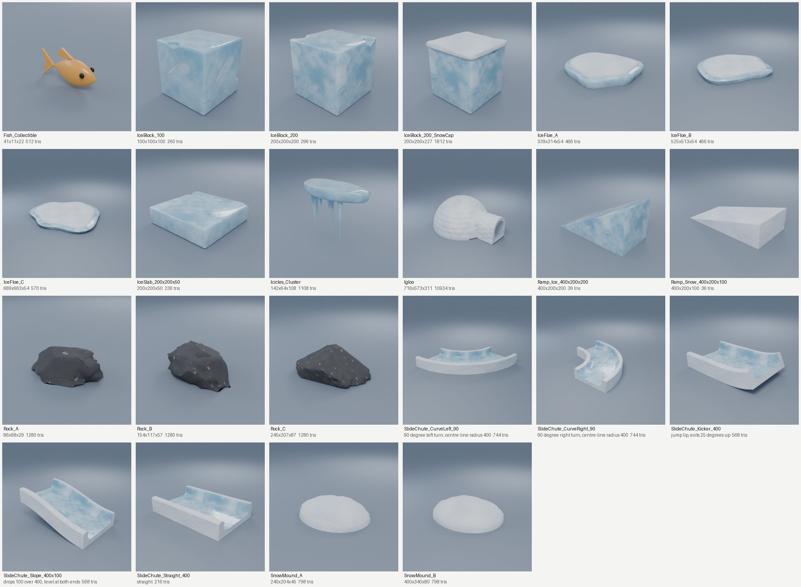
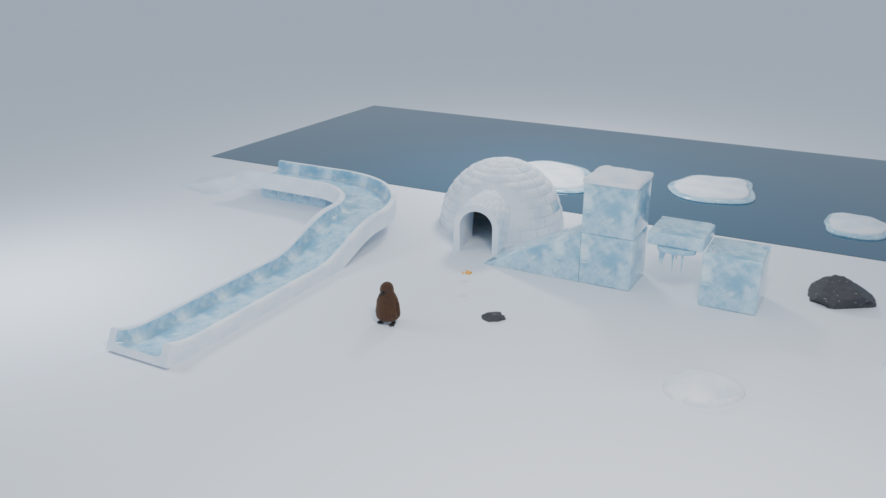
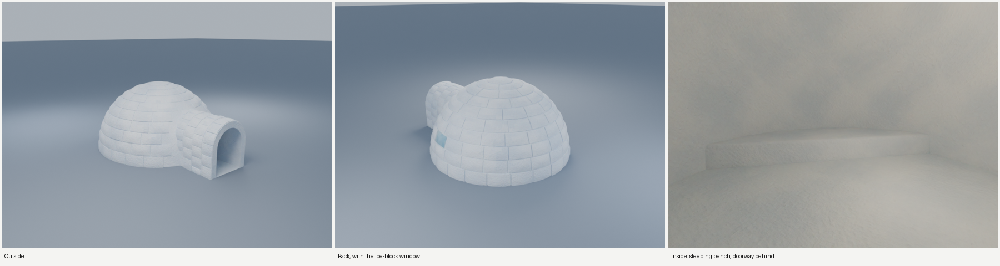

# Penguin level kit

This kit holds 22 static meshes for building penguin levels: ice blocks, ramps, slide-chute track pieces, an
igloo, ice floes, snow mounds, rocks, an icicle cluster and a fish collectible. Every piece is generated by a
script, so any size, shape or count can be changed and rebuilt.

**Download for Unreal:** [`dist/PenguinKit_Unreal.zip`](../dist/PenguinKit_Unreal.zip) has every mesh with its
collision and sockets, the textures, reference data, previews and the Blender source. Its `IMPORT_GUIDE.html`
walks through importing into Unreal Engine 5, setting up the materials and building a level. The guide's source is
[`IMPORT_GUIDE.md`](IMPORT_GUIDE.md), and `python3 tools/package_props_unreal.py` rebuilds the zip.





The vignette shows a small level built only from the kit, with Pebble Chick for scale (about 152 cm tall). The
slide track is five chute pieces snapped together through their sockets: straight, right curve, slope,
straight, kicker. Its first piece rests on a row of 100 cm ice blocks, and the igloo stands behind the chick.



The igloo is built from courses of snow blocks with a key block on top, an entrance tunnel and one clear
ice block as a window. Inside, the room is 500 cm across and 264 cm high, with a 45 cm snow bench along the back
wall. The doorway is 140 cm wide and 179 cm high, so the chick can walk in. Its collision is 65 convex pieces
that cover the wall but leave the doorway, tunnel and room open. Sockets mark the entrance, the floor centre and
the bench.

## The pieces

| Mesh | Size (cm) | Triangles | Collision | Notes |
|---|---|---|---|---|
| `SM_IceBlock_100` | 100 × 100 × 100 | 260 | 1 box | Bevelled, with chipped edges and corners. |
| `SM_IceBlock_200` | 200 × 200 × 200 | 296 | 1 box | |
| `SM_IceSlab_200x200x50` | 200 × 200 × 50 | 236 | 1 box | For platforms and steps. |
| `SM_IceBlock_200_SnowCap` | 200 × 200 × 227 | 1,812 | 1 box | A 200 cm block with a rounded pillow of snow on top. |
| `SM_Ramp_Snow_400x200x100` | 400 × 200 × 100 | 36 | 1 wedge | 13.6° slope, walkable. |
| `SM_Ramp_Ice_400x200x200` | 400 × 200 × 200 | 36 | 1 wedge | 26.2° slope, for slides and jumps. |
| `SM_SlideChute_Straight_400` | 400 long | 216 | 12 hulls | 200 cm wide ice channel with snow walls 50 cm high. |
| `SM_SlideChute_CurveLeft_90` | radius 400 | 744 | 48 hulls | 90° turn; exits at (400, 400, 0). |
| `SM_SlideChute_CurveRight_90` | radius 400 | 744 | 48 hulls | 90° turn; exits at (400, −400, 0). |
| `SM_SlideChute_Slope_400x100` | 400 long | 568 | 36 hulls | Drops 100 cm; level at both ends. |
| `SM_SlideChute_Kicker_400` | 400 long | 568 | 36 hulls | Jump lip; exits 25° upward, 30 cm higher. |
| `SM_IceFloe_A`, `_B`, `_C` | 339, 525, 689 wide | 466–570 | 1 hull | 54 cm thick with snow on top. Float them about a third under water. |
| `SM_SnowMound_A`, `_B` | 240 × 204 × 45, 400 × 340 × 80 | 798 | 1 hull | |
| `SM_Rock_A`, `_B`, `_C` | 86, 154, 245 wide | 1,280 | 1 hull | Dark volcanic rock. |
| `SM_Icicles_Cluster` | 142 × 64 × 108 | 1,108 | 8 hulls | Hangs from its pivot. Use the collision as a damage trigger if icicles are a hazard. |
| `SM_Fish_Collectible` | 41 × 11 × 22 | 512 | 1 hull | Gold, so it stands out against ice and snow. Spin and bob it in a Blueprint. |
| `SM_Igloo` | 716 × 573, 302 high | 10,934 | 65 hulls | Walk-in igloo; entrance tunnel along +X. Sockets `SOCKET_Entrance`, `SOCKET_Interior` and `SOCKET_Bench`. |

Exact numbers for every piece are in `Kit/props_stats.json`.

## Conventions

- **Units and grid.** Centimetres with Z up. Blocks, ramps and chutes are multiples of 100 cm, so they line
  up on Unreal's default 10, 50 and 100 snap grid.
- **Pivots.** Most pieces sit on the floor at the centre of their footprint. Chute pieces pivot at the
  centre of the entrance floor and run along +X. The igloo pivots at the floor centre of its dome, with the
  entrance along +X. The icicles pivot at the top centre, and the fish at its centre.
- **Collision.** Each FBX includes `UCX_<mesh>_NN` convex hulls, which Unreal imports as simple collision.
  Chutes use many hulls, one floor slab and two walls per segment, so a sliding penguin stays inside the
  channel.
- **Sockets for chaining.** Chute pieces carry `SOCKET_Start` and `SOCKET_End` (static mesh sockets in
  Unreal). To chain them, place the next piece at the previous piece's `SOCKET_End` transform and the track
  joins without seams. The slope and kicker change height, and the curves change direction.
- **UVs and textures.** UV0 is world-scaled, so all props share three tileable texture sets and texel density
  stays even: one tile covers 200 cm of ice or snow, or 100 cm of rock. Each set in `Kit/Textures/` has
  `T_<Set>_BaseColor` (sRGB), `T_<Set>_Normal_DX` for Unreal, `T_<Set>_Normal_GL` for Blender, and
  `T_<Set>_ORM` (R = ambient occlusion, G = roughness, B = metallic).
- **Materials.** There are five slots: `M_Ice`, `M_Snow`, `M_Rock`, `M_Fish` and `M_FishEye`. The fish
  colours are flat. Ice, snow and rock use the texture sets. The import guide sets them up as one master
  material with three instances, plus an optional fresnel glow for ice.

## Files

| Path | What it is |
|---|---|
| `Kit/Meshes/SM_*.fbx` | One FBX per prop: the mesh plus its collision hulls and sockets. |
| `Kit/Textures/T_*.png` | Tileable 1024 px texture sets for Ice, Snow and Rock. |
| `Kit/Penguin_Kit.blend` | All props in one Blender scene, with materials set up. |
| `Kit/props_stats.json` | Size, triangles, pivot, collision and sockets for every prop. |
| `Kit/Previews/` | The contact sheet, the vignette and the igloo views above. |
| `IMPORT_GUIDE.md` | Step-by-step Unreal import guide (also in the zip as HTML). |
| `../tools/make_props.py` | Builds every prop, exports the FBX files and writes the stats. |
| `../tools/prop_textures.py` | Generates the tileable texture sets (NumPy only). |
| `../tools/render_props.py` | Renders the contact sheet, the vignette and the igloo views. |
| `../tools/package_props_unreal.py` | Builds `dist/PenguinKit_Unreal.zip`. |

## Rebuilding or changing a piece

```
pip install bpy numpy scipy pillow
python3 tools/make_props.py --out props/Kit            # all props (add --only SM_Rock_A,SM_Rock_B for a few)
python3 tools/render_props.py props/Kit                # previews
python3 tools/package_props_unreal.py                  # dist/PenguinKit_Unreal.zip
```

Sizes live in `kit_specs()` in `tools/make_props.py`. Change `ice_block(..., 200, 200, 200)` to make a new
block size, add a line to make a new rock (`seed` picks the shape), or change the chute constants
(`CHUTE_W`, `CHUTE_WALL`, `CHUTE_H`) to widen or deepen the slide. The igloo's room, wall, tunnel and bench
sizes are the `IG_` constants above `igloo()`.
